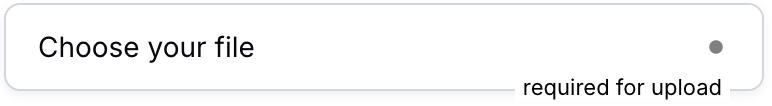
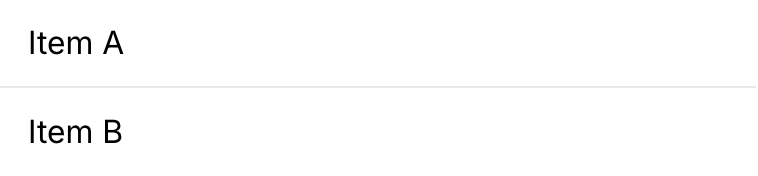
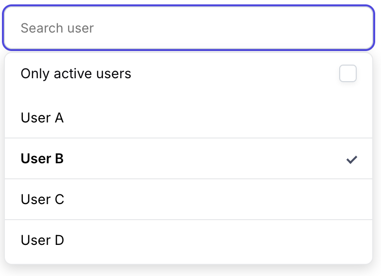

# blend.css

Blend.css is a minimal, component based UI library.

It allows you to write and maintain user interfaces with clean, parameterizable code, using adaptable, nestable and ready-to-use components that are configurable in their parameters.

It is not intended to be modified by means of classes, but by well-defined descriptive properties, with the aim of writing code that is readable by developers without prior knowledge.


## Components

Blend.css works around a few key components that can be nested and parameterized separately or together.

All components are configurable using HTML tags that begin with the `bl-` prefix and can be configured using their properties.

Although many core components use the `bl-` prefix, some internal elements use standard HTML in order to minimize the weight of the library. In the case of `bl-input`, its internal elements are used to create parts that most inputs use, such as **labels**, **icons**, **links**, and others.

- [Inputs](#inputs)
  - Text (and Date, Number,...)
  - Textarea
  - Button
  - Checkbox
  - Radio
  - File
  - Select
- Avatar
- List
- Item
- Dropdown


## Inputs

The `<bl-input>` component is the core of inputs, buttons and form selectors. With it you can create text fields, textarea, button, checkbox, radio, file and select inputs. 

### Minimal use

```html
<bl-input>
	<input type="text" placeholder="This is an input" />
</bl-input>
```


### Extended use

Obviously most form fields require extra internal components to adapt to different scenarios.
Some of them need to be in a specific position to work correctly.

**The internal components currently available are:**

| **TAG** | Common use | Restriction |
| ----- | ----- | ----- |
| **label** | To display the input name, it is usually located in the top left section of the input. | It must be the first tag of the input    |
| **i** | Represents the input icon, I recommend the [UI Icons library](https://www.flaticon.com/uicons/interface-icons), but you can use the one you prefer. | - |
| **a** | To display an comment or actions related to the input, it is usually located in the top right section of the input. | - |
| **pre** | To display a prefix or suffix for an input. | - |
| **kbd** | To display a key shortcut or annotation for an input, it is usually represented as a box similar to a keyboard button. | - |


```html
<bl-input>
	<label>User name</label>
	<i class="fi fi-rr-user"></i>
	<a href="/signUp">SignUp</a>
	<pre>https://</pre>
	<input type="text" placeholder="This is an input" />
	<kbd>⌘R</kbd>
</bl-input>
```


### Input modifiers
There are four types of modifiers for inputs, **composition**, **status**, **layout** and **auxiliary** modifiers.
- **composition** modifiers change the composition of the input.
- **status** modifiers modify the color.
- **layout** modifiers change de layout of [Blended inputs](#blended-inputs).
- **auxiliary** modifiers change some extra characteristics.

It is possible to mix **composition**, **status**, **layout** and **auxiliary** modifiers with each other.
Only **auxiliary** and **layout** modifiers can be combined with each other.
You can select the modifier you want by simply assigning the corresponding property to the input, for example **[inset]**:
```html
<bl-input inset> <!-- inset property here -->
	<label>User name</label>
	<i class="fi fi-rr-user"></i>
	<a href="/signUp">SignUp</a>
	<pre>https://</pre>
	<input type="text" placeholder="This is an input" />
	<kbd>⌘R</kbd>
</bl-input>
```

| **Type**		| **Property**	| Effect						|									|
| -				| -				| -								| -									|
| composition	| **inset**		| Causes label incorporation	| 	|
| composition	| **overlap**	| Causes label overlap			| 	|

| **Type**		| **Property**	| Effect						| 									|
| -				| -				| -								| -									|
| status		| **error**		| Error coloring				|  		|
| status		| **success**	| Success coloring				|  		|
| status		| **disabled**	| Disabled coloring				|  		|

| **Type**		| **Property**	| Effect						| Availability 						| Target		| 									|
| -				| -				| -								| -									| -				| - 								|
| layout		| **static**	| disable expansion				| [Blended inputs](#blended-inputs)	| nested input	|  		|
| layout		| **inline**	| removes division lines		| [Blended inputs](#blended-inputs)	| root input	|  		|
| layout		| **column**	| transforms layout to columns	| [Blended inputs](#blended-inputs)	| root input	|  		|

| **Type**		| **Property**	| Effect						| Availability 						| 									|
| -				| -				| -								| -									| - 								|
| auxiliary		| **clean**		| Removes outline and paddings	| `checkbox` `radio`				|  |
| auxiliary		| **reverse**	| Reverses de input composition | `any`								|  |
| auxiliary		| **required-label**	| If `bl-input` contains an [required] element <u>and</u> has the **required-label** defined, displays the **required-label** at the bottom right corner | `any`								|  |


### File and Select element

The `[type=file]` and `select` elements have a special treatment to mask and generalize their operation in different browsers. You should only always consider adding a `label` element as the next sibling, this `label` element will behave graphically as the `[type=file]` or `select` field as appropriate.

You will need to make sure to change the `label` text when the `change` event of the `[type=file]` or `select` field is triggered, or you can optionally choose to import and implement the pollyfills from `blend.js`

```html
<bl-input>
	<select>
		<option value="1">Option A</option>
		<option value="2">Option V</option>
		<option value="3">Option C</option>
	</select>
	<label>Option A</label> <!-- this label is required for select -->
</bl-input>
```


```html
<bl-input>
	<input type="file" />
	<label>Choose your file</label> <!-- this label is required [type=file] -->
</bl-input>
```


### Avatar

Reprecents a user picture

```html
<bl-avatar>
	
</bl-avatar>
```


#### Avatar modifiers
| **Property**				| Effect														|																|
| -										| -																	| -															|
| **small**						| Resizes avatar to 24px						| 		|
| **online**					| Displays online indicator					| 		|
| **online="false"**	| Displays offline indicator				| 	|
| **offline**					| Displays offline indicator				| 	|
| **badge="x"**				| Displays a badge with a "x" value	| 		|

### List

The `bl-list` component is just a scrollable list item container. It can contains `bl-item`, or `bl-input` components

```html
<bl-list>
	<bl-item>Item A</bl-item>
	<bl-item>Item B</bl-item>
</bl-list>
```

#### List modifiers
| **Property**				| Effect												|																|
| -										| -															| -															|
| **free**						| Disables scroll height limit	| 				|
| **divided**					| Adds a divider between items	| 		|


### Item

The `bl-item` component represents a row in a list. For advanced item layouts you can use [Blended items](#blended-items)

```html
<bl-item>Item A</bl-item>
```


#### Item modifiers

| **Property**		| Effect									|																|
| -								| -												| -															|
| **on**					| Adds a on marker				| 					|
| **off**					| Adds a off marker				| 				|
| **selected**		| Adds a selected marker	| 		|


### Blending items

You can combine multiple components into one item by simply nesting them, in the case of items you can nest them like this:

```html
<bl-item>
	<bl-avatar small>
		
	</bl-avatar>
	<bl-input clean>
		<input type="checkbox" />
		<label>Choose user</label> <!-- this label is required [type=file] -->
	</bl-input>
</bl-item>
```


### Dropdown

The `bl-dropdown` component is just a container that is displayed against :hover or :focus events, or by setting the open property.

It is intended to display lists for search results or filters.

It works in conjunction with `bl-input` by adding it as a child node. When the user focuses on the previous sibling input, the `bl-dropdown` component is automatically displayed.

```html
<bl-input>
	<input type="text" placeholder="Search user" />
	<bl-dropdown> <!-- dropdown must be next to the input --> 
		<bl-list divided>
			<bl-item>User A</bl-item>
			<bl-item selected>User B</bl-item>
			<bl-item>User C</bl-item>
			<bl-item>User D</bl-item>
		</bl-list>
	</bl-dropdown>
</bl-input>
```


#### Dropdown modifiers

| **Property**		| Effect					|																|
| -								| -								| -															|
| **open**				| Forces display	| 		|

You can add non-scrollable items to the `bl-dropdown` by simply not adding them to a `bl-list` component



### Blending inputs

You can combine multiple components into one by simply nesting them, in the case of inputs you can nest them like this:

```html
<bl-input>
	<label>Search on internet</label>
	<a>required</a>
	<bl-input>
		<i class="fi fi-rr-search"></i>
		<input type="text" placeholder="What do you want to search for?" />
	</bl-input>
	<bl-input>
		<input type="checkbox" placeholder="username" />
		<label>I feel lucky</label>
	</bl-input>
</bl-input>
```
 

All the properties of the root input will be applied on its nested inputs and you will be able to apply the layout type modifiers on it.

In the previous example the checkbox should not be the same size as the search field, to solve that you can apply the static property on the input corresponding to the checkbox as follows:

```html
<bl-input>
	<label>Search on internet</label>
	<a>required</a>
	<bl-input>
		<i class="fi fi-rr-search"></i>
		<input type="text" placeholder="What do you want to search for?" />
	</bl-input>
	<bl-input static> <!-- static property -->
		<input type="checkbox" placeholder="username" />
		<label>I feel lucky</label>
	</bl-input>
</bl-input>
```


If you need a more continuous interface you can remove internal elements with the inline property as follows:

```html
<bl-input inline> <!-- inline property -->
	<label>Search on internet</label>
	<a>required</a>
	<bl-input>
		<i class="fi fi-rr-search"></i>
		<input type="text" placeholder="What do you want to search for?" />
	</bl-input>
	<bl-input static>
		<input type="checkbox" placeholder="username" />
		<label>I feel lucky</label>
	</bl-input>
</bl-input>
```


By default nested elements are aligned horizontally. You can change to column alignment with the column property follows:

```html
<bl-input column> <!-- column property -->
	<label>Search on internet</label>
	<a>required</a>
	<bl-input>
		<i class="fi fi-rr-search"></i>
		<input type="text" placeholder="What do you want to search for?" />
	</bl-input>
	<bl-input>
		<input type="checkbox" placeholder="username" />
		<label>I feel lucky</label>
	</bl-input>
</bl-input>
```


In a more real-world example, a login form could be coded like this:
```html
<bl-input column>
	<label>Sign In</label>
	<a href>Sign Up</a>
	<bl-input inset>
		<label>Username</label>
		<i class="fi fi-rr-user"></i>
		<input type="text" placeholder="jhon" />
	</bl-input>
	<bl-input inset>
		<label>Password</label>
		<i class="fi fi-rr-lock"></i>
		<input type="text" placeholder="····" />
	</bl-input>
</bl-input>
```


